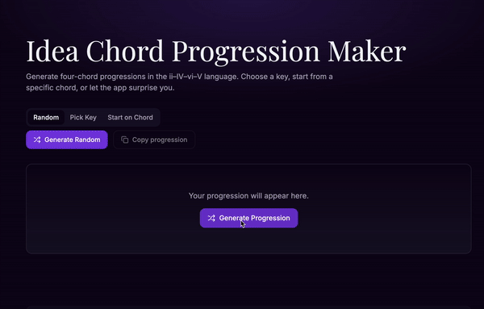

# "Alcocer Idea" Chord Generator

**A dynamic chord generation and exploration tool for musicians and composers**



## About

The "Alcocer Idea" Chord Generator is a simple web application that helps create chord progressions. It was built as a hobby project to easily generate some musical ideas when I get stuck with the same old patterns. This tool is inspired by Gibran Alcocer's "Idea" songs - those short, catchy chord progressions that get stuck in your head. The name "Alcocer Ideas" comes from that concept of simple but effective musical ideas.

## Live Demo

🎵 **Try it live**: [https://alcocer-chord-alchemy.lovable.app/](https://alcocer-chord-alchemy.lovable.app/)

## Features

- Generates chord progressions
- Simple web interface
- Works on desktop and mobile
- Built with React and TypeScript

## Tech Stack

- React + TypeScript
- Tailwind CSS + shadcn/ui components
- Vite for building
- Deployed on Lovable

## Getting Started

### Prerequisites

- Node.js (version 18 or higher)
- npm or yarn package manager

### Local Development

1. **Clone the repository**
   ```bash
   git clone https://github.com/dagjomar/alcocer-chord-alchemy.git
   cd alcocer-chord-alchemy
   ```

2. **Install dependencies**
   ```bash
   npm install
   ```

3. **Start the development server**
   ```bash
   npm run dev
   ```

4. **Open your browser**
   Navigate to `http://localhost:5173` to see the application running locally.

### Available Scripts

- `npm run dev` - Start development server with hot reload
- `npm run build` - Build for production
- `npm run preview` - Preview production build locally

## Contributing

Feel free to contribute if you find this useful! You can:
- Report bugs or suggest features
- Submit pull requests for improvements
- Add new chord generation ideas
- Improve the UI or add new features

### How to Contribute

1. Fork the repository
2. Create a feature branch (`git checkout -b feature/amazing-feature`)
3. Make your changes
4. Commit your changes (`git commit -m 'Add amazing feature'`)
5. Push to the branch (`git push origin feature/amazing-feature`)
6. Open a Pull Request

## License

This project is open source and available under the [LICENSE](LICENSE) file.

## Acknowledgments

- Built with [Lovable](https://lovable.dev) for easy deployment
- Help by [Cursor](https://www.cursor.com) for further development
- UI components from [shadcn/ui](https://ui.shadcn.com/)
- Inspired by Gibran Alcocer's musical ideas
- Brought to life by Dag Jomar Mersland

---

**Happy chord exploring! 🎼✨**
